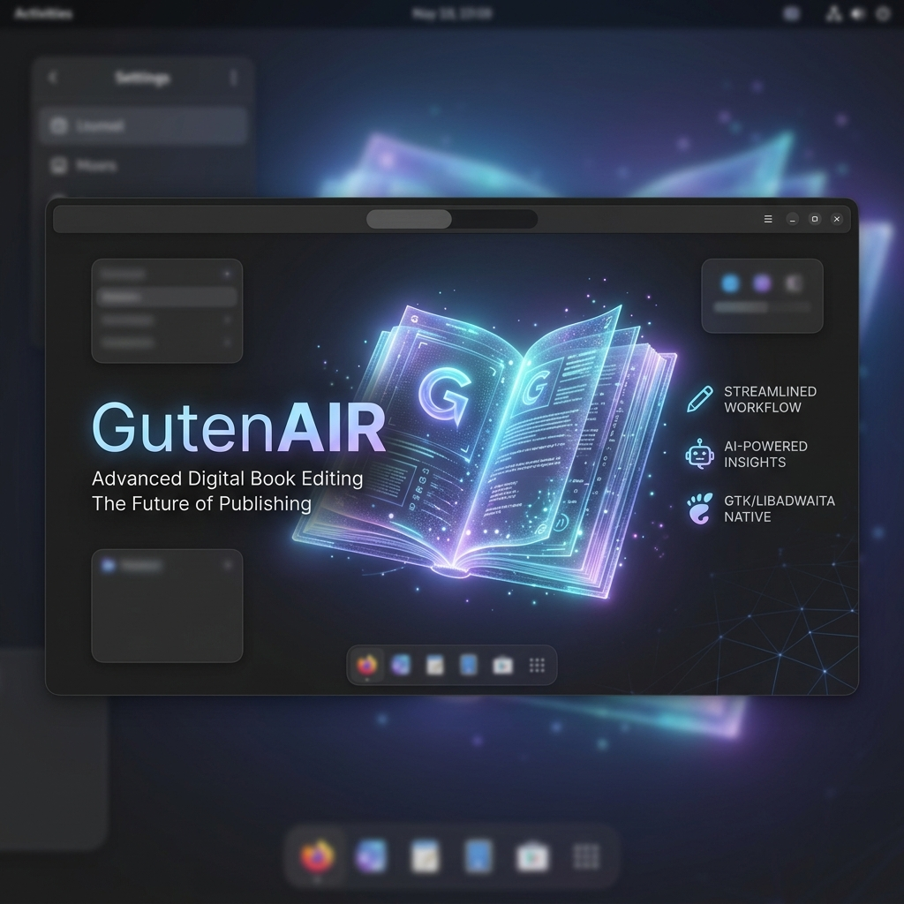

# 📚 GutenAIR



**GutenAIR** es un editor de libros digitales premium diseñado para ofrecer una experiencia fluida y potente en la gestión y edición de proyectos literarios (EPUB). Construido con **Rust**, **GTK4** y **Libadwaita**, sigue las últimas pautas de diseño de GNOME para integrarse perfectamente en entornos de escritorio modernos.

## ✨ Características Principales

-   **🛠️ Editor Integrado:** Edición de texto con resaltado de sintaxis (HTML, CSS, XML) vía `SourceView5`.
-   **👁️ Vista Previa en Tiempo Real:** Visualización instantánea del contenido utilizando `WebKit6`.
-   **📊 Estadísticas Detalladas:** Informes completos por capítulo y libro (conteo de palabras, párrafos, tiempo estimado de lectura, etc.).
-   **🖼️ Visor de Medios:** Gestor de imágenes integrado para visualizar los recursos del libro.
-   **📤 Exportación Versátil:** Exporta tus proyectos a formato **EPUB** o como **Texto Plano**.
-   **📂 Gestión de Proyectos:** Historial de archivos recientes y exploración estructurada por grupos (Texto, Estilos, Imágenes, Fuentes, etc.).
-   **🤖 Integración con IA:** Soporte experimental para asistencia vía **Ollama**.
-   **🔗 Constructor de Navegación:** Herramientas para gestionar y fusionar la Tabla de Contenidos (TOC) de forma inteligente.

## 🚀 Tecnologías

GutenAIR utiliza un stack moderno y eficiente:

-   **Lenguaje:** [Rust](https://www.rust-lang.org/)
-   **Interfaz:** [GTK4](https://www.gtk.org/) + [Libadwaita](https://gnome.pages.gitlab.gnome.org/libadwaita/)
-   **Motor Web:** [WebKitGTK (webkit6)](https://webkitgtk.org/)
-   **Edición:** [GtkSourceView 5](https://wiki.gnome.org/Projects/GtkSourceView)
-   **Core:** Engine propio desarrollado en Rust (`gutencore`).

## 🛠️ Instalación

### Requisitos

Asegúrate de tener instaladas las dependencias de desarrollo de GTK4, Libadwaita, WebKitGTK y GtkSourceView 5 en tu sistema:

```bash
# Ejemplo en Fedora
sudo dnf install gtk4-devel libadwaita-devel webkit6gtk-devel gtksourceview5-devel
```

### Compilación desde el origen

1.  Clona el repositorio:
    ```bash
    git clone https://github.com/tu-usuario/GutenAIR-gtk4.git
    cd GutenAIR-gtk4
    ```

2.  Compila e instala el esquema de GSettings:
    ```bash
    glib-compile-schemas .
    ```

3.  Ejecuta el proyecto con Cargo:
    ```bash
    cargo run
    ```

## 📸 Capturas de Pantalla

*(Próximamente)*

## 🤝 Contribuir

¡Las contribuciones son bienvenidas! Si tienes ideas para nuevas funciones o has encontrado un error, no dudes en abrir un *issue* o enviar un *pull request*.

## ⚖️ Licencia

Este proyecto está bajo la Licencia **MIT**. Consulta el archivo `LICENSE` para más detalles.

---

Desarrollado con ❤️ por el equipo de **GutenAIR**.
Assistencia de diseño por **Antigravity AI**.
